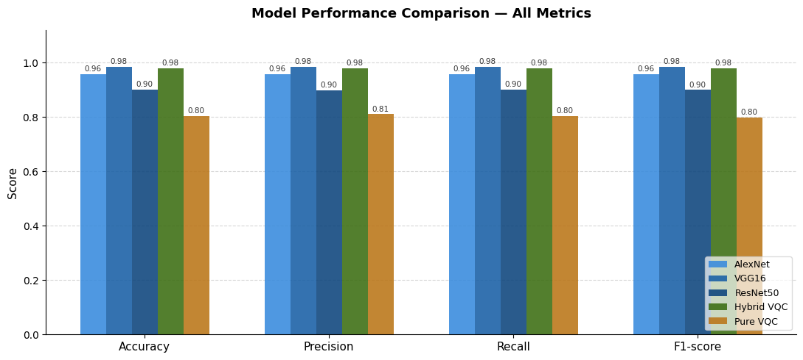
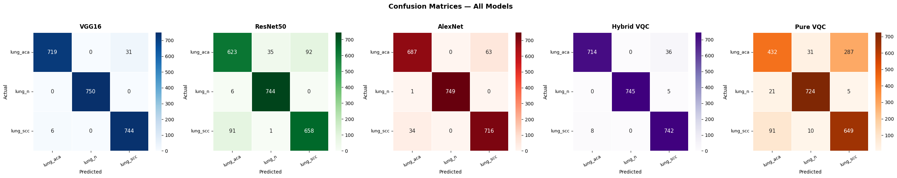
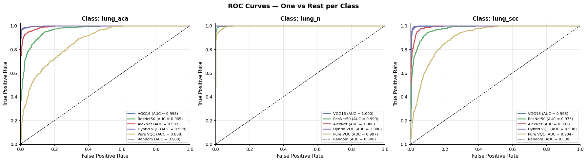
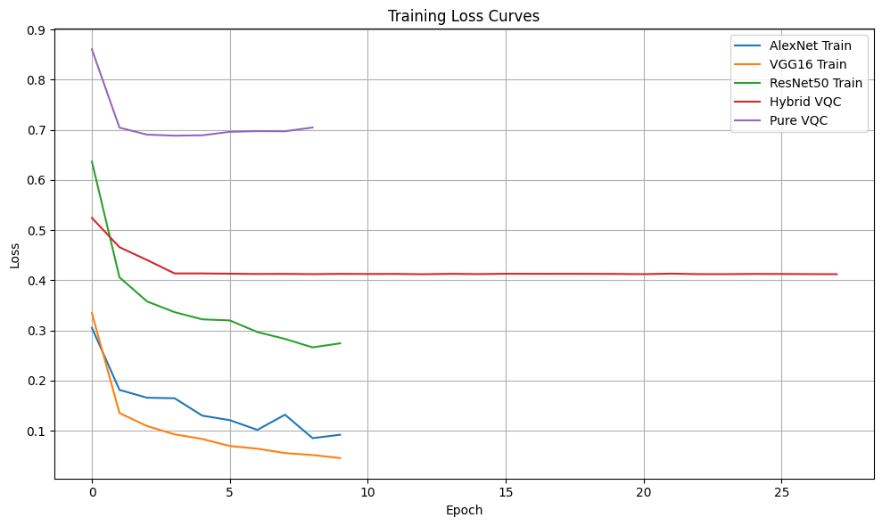
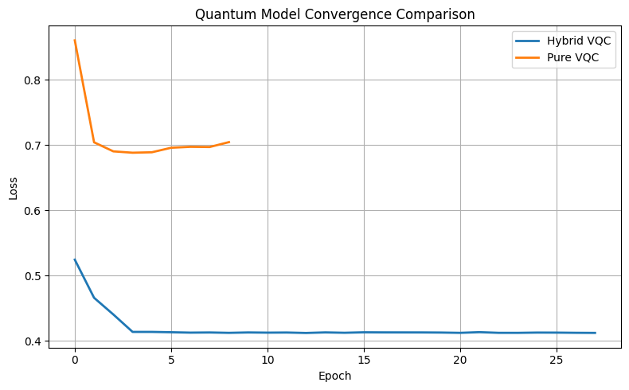
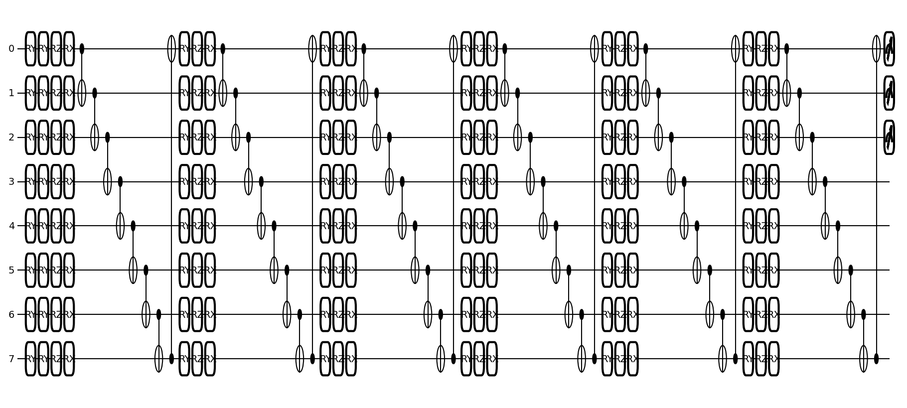

# Lung Cancer Histopathology Classification: CNN & Hybrid VQC

Comparative study of **classical CNNs, a Hybrid CNN–VQC model, and a Pure VQC model** for three-class lung histopathology classification using the **LC25000** dataset.


## Highlights

- 15,000 lung histopathology images across 3 classes
- Classical baselines: **AlexNet, VGG16, ResNet50**
- Hybrid quantum model: **VGG16 features → PCA → 4-qubit VQC**
- Pure quantum model: **raw pixels → PCA → 8-qubit VQC**
- Evaluation with Accuracy, Precision, Recall, F1, ROC-AUC and confusion matrices
- Quantum-circuit and convergence visualizations
- Grad-CAM support for CNN explainability

## Results

| Model | Accuracy | Precision | Recall | F1 |
|---|---:|---:|---:|---:|
| **VGG16** | **98.36%** | 98.39% | 98.36% | 98.36% |
| **Hybrid VQC** | **97.82%** | 97.89% | 97.82% | 97.83% |
| AlexNet | 95.64% | 95.69% | 95.64% | 95.64% |
| ResNet50 | 90.00% | 89.88% | 90.00% | 89.92% |
| Pure VQC | 80.22% | 81.01% | 80.22% | 79.70% |



The Hybrid VQC is close to the best classical result while using only four PCA-reduced VGG16 features as input to the quantum classifier. The Pure VQC provides a lower-performing baseline using PCA-reduced raw image pixels.

## Method

### Classical CNN branch

Images are resized to **224×224×3** and used with transfer-learning CNNs:

- AlexNet
- VGG16
- ResNet50

### Hybrid CNN–VQC branch

```text
224×224 image
      ↓
    VGG16
      ↓
  512 features
      ↓
    PCA
      ↓
  4 features
      ↓
  4-qubit VQC
      ↓
  3-class output
```

### Pure VQC branch

```text
64×64×3 image
      ↓
  12,288 pixels
      ↓
    PCA
      ↓
  8 features
      ↓
  8-qubit VQC
      ↓
  3-class output
```

The executed notebook uses a **4-qubit / 4-layer** hybrid circuit and an **8-qubit / 6-layer** Pure VQC circuit.

## Evaluation

### Confusion matrices



### ROC-AUC



### Training and quantum convergence





### Quantum circuit



## Dataset

The notebook uses the Kaggle **Lung and Colon Cancer Histopathological Images (LC25000)** dataset and selects:

- `lung_aca` — lung adenocarcinoma
- `lung_n` — normal lung
- `lung_scc` — lung squamous cell carcinoma

Split used in the notebook:

- Training: **10,500**
- Validation: **2,250**
- Test: **2,250**

## Tech Stack

**Python · TensorFlow/Keras · scikit-learn · PennyLane · JAX · Qiskit · NumPy · Pandas · OpenCV · Matplotlib · Seaborn**

## Run

```bash
pip install -r requirements.txt
jupyter notebook lung_cancer_hybrid_vqc.ipynb
```

The notebook can also be run in Google Colab.

Dataset acquisition is handled inside the notebook through KaggleHub.

## Repository Structure

```text
lung-cancer-hybrid-vqc/
├── README.md
├── requirements.txt
├── lung_cancer_hybrid_vqc.ipynb
│
├── architecture/
│   ├── methodology_overview.png
│   └── methodology_overview_corrected.png
│
├── results/
│   ├── performance_comparison.png
│   ├── performance_heatmap.png
│   ├── confusion_matrices.png
│   ├── normalized_confusion_matrices.png
│   ├── roc_curves.png
│   ├── auc_comparison.png
│   ├── training_loss.png
│   ├── classical_training_accuracy.png
│   ├── quantum_convergence.png
│   └── quantum_circuit.png
│
├── explainability/
├── models/
└── docs/
    ├── METHODOLOGY.md
    └── RESULTS.md
```

## Notes

The included figures are extracted from the executed notebook outputs. The repository does **not** include the full LC25000 dataset.

This is an academic/research project and **not a clinical diagnostic system**.

## Author

**Gautam Kansal**
